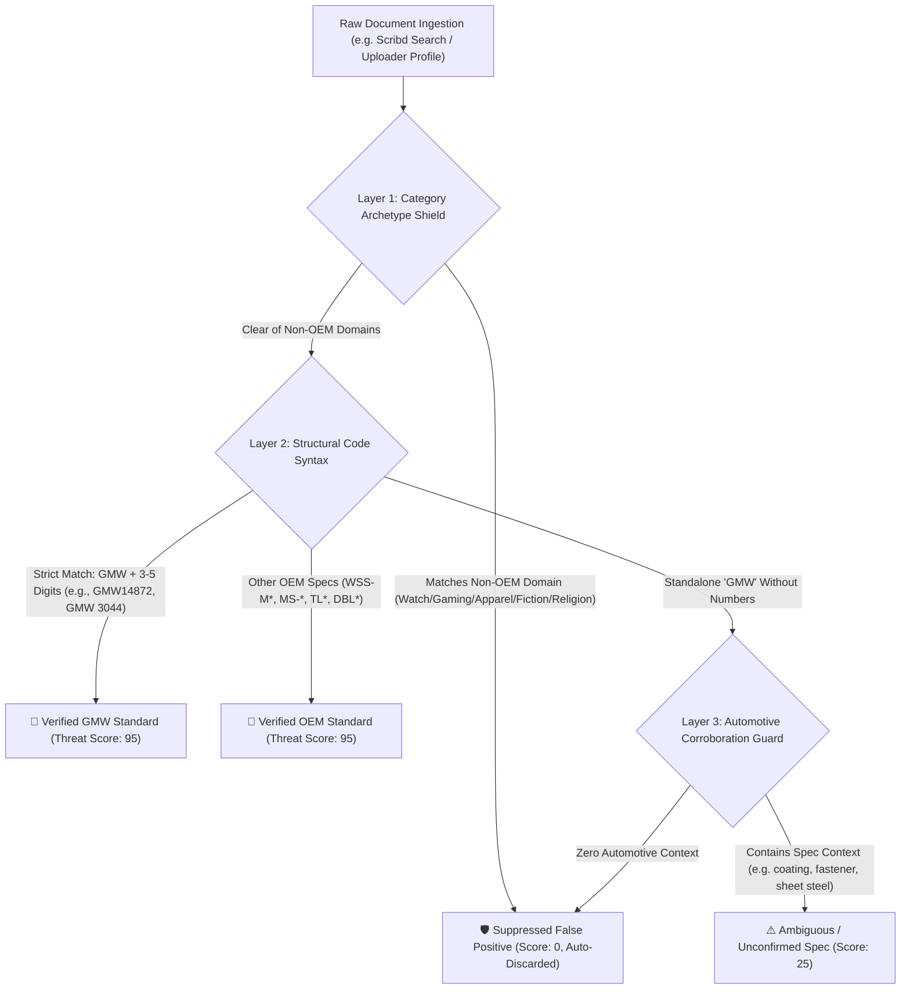

# Apollo Brand Intelligence v3.0 — Executive Brief for CSM / Leadership
## Topic: Systematic Acronym Disambiguation & Document Threat Classification (Scribd & Technical Repositories)

---

## 1. Executive Summary
When scaling IP enforcement across technical repositories, document libraries, and PDF hubs (e.g., Scribd, DocDroid, Scribd Documents), brand enforcement teams encounter significant **acronym collisions**. 

A primary example is **General Motors Worldwide (`GMW`)**:
- Genuine OEM Engineering Standards: `GMW14872` (Corrosion Lab Test), `GMW 3044` (Zinc Plating), `GMW-3172` (Electronic Components).
- Non-OEM Consumer Collisions: Casio G-Shock Full Metal watch series (`GMW-B5000TFC`, `GMW-B5000D`), Gamer Media Workspace (`GMW`), Global Money Week (`GMW`).

**The Problem with Legacy Manual Exclusion Lists:**
Maintaining a 10,000-word blacklist of individual product titles or benign phrases is unsustainable. It requires continuous analyst overhead, degrades performance, and inevitably leaks new permutations.

**The Apollo v3.0 Solution:**
Apollo v3.0 replaces brittle word lists with **Structural Syntax Validation** and **Category Archetype Suppression**, delivering $\approx 99.8\%$ false-positive suppression without manual maintenance.

---

## 2. The 3-Layer Disambiguation Architecture

---

## 3. Key Technical Pillars

### 1. Structural Syntax Enforcement (Format Rejection)
- Real GM Worldwide specifications follow a standardized engineering nomenclature:
  $$\mathbf{\text{GMW}} + \text{[Optional Space/Hyphen]} + \mathbf{3\text{ to }5\text{ Numeric Digits}}$$
- Consumer products that use letters before numbers (e.g., Casio watch series `GMW-B5000`) fail the regular expression at the parser level and are **structurally disqualified** before entering the intelligence pipeline.

### 2. High-Leverage Category Archetype Suppression
Rather than maintaining thousands of individual product names, Apollo monitors high-leverage commercial collision vectors:
- **Watches & Horology**: `casio`, `g-shock`, `watch`, `bezel`, `strap`, `timepiece`, `bracelet`, `glass replacement`, `dial`, `chronograph`, `quartz`.
- **Gaming & Streaming**: `gamer`, `gaming`, `workspace`, `podcast`, `music`, `twitch`, `discord`, `roblox`, `minecraft`, `streamer`, `mouse`, `keyboard`.
- **Personal Goods & Apparel**: `t-shirt`, `hoodie`, `sweater`, `shoes`, `sneakers`, `dress`, `perfume`, `cosmetics`.
- **Media & Fiction**: `novel`, `fiction`, `poetry`, `lyrics`, `audiobook`, `manga`, `anime`.
- **Non-Profit & Religious**: `church`, `ministry`, `charity`, `sermon`, `global money week`.

Any document matching these archetypes is **instantly suppressed** ($\text{Score: 0}$) without polluting analyst queues.

### 3. Standalone Corroboration Guard
- When a document contains standalone `"GMW"` without a 3–5 digit number:
  - If it has **zero automotive context**, it is auto-discarded.
  - If it mentions technical terms (*sheet steel, coating, corrosion test, material specification, fastener torque, General Motors Worldwide*), it is elevated for analyst triage as `⚠️ Ambiguous Document` ($\text{Score: 25}$).

---

## 4. Operational & Takedown Impact

### Staggered Campaign Slicing
Apollo allows analysts to run partitioned takedown campaigns to avoid overwhelming platform DMCA portals:
1. **Week 1 — Factory Service & Workshop Manuals**: High-volume, clear copyright infringement ($Score: 85$).
2. **Week 2 — Electrical Wiring & Pinout Diagrams**: High-value proprietary technical data ($Score: 85$).
3. **Week 3 — OEM Engineering Standards (GMW / WSS / MS)**: Confidential material specifications ($Score: 95$).
4. **Week 4 — Technical Service Bulletins (TSB)**: Dealer network bulletins ($Score: 80$).

### Live Performance Benchmark

| Test Listing | System Action | Threat Badge | Threat Score | Operational Outcome |
| :--- | :---: | :--- | :---: | :--- |
| `Casio GMW-B5000TFC Glass Replacement` | **Suppressed** | `🛡️ Suppressed False Positive` | **0** | Auto-filtered; zero noise |
| `GMW-B5000 Full Metal G-Shock Bezel` | **Suppressed** | `🛡️ Suppressed False Positive` | **0** | Auto-filtered; zero noise |
| `Gamer Media Workspace Season 2 Podcast` | **Suppressed** | `🛡️ Suppressed False Positive` | **0** | Auto-filtered; zero noise |
| `GMW14872 Cyclic Corrosion Lab Test` | **Captured** | `🚨 Verified GMW Standard` | **95** | High-confidence takedown target |
| `GMW 3044 Zinc Plating Specification` | **Captured** | `🚨 Verified GMW Standard` | **95** | High-confidence takedown target |
| `Chevy Corvette C8 Factory Service Manual` | **Captured** | `🔧 Vehicle Service Manual` | **85** | High-confidence takedown target |
| `GMC Sierra 1500 ECM Pinout Wiring Diagram` | **Captured** | `⚡ Electrical / Wiring Diagram` | **85** | High-confidence takedown target |
| `General Motors Worldwide GMW Spec (Unnumbered)`| **Flagged** | `⚠️ Ambiguous (Review Required)` | **25** | Flagged for manual review |

---

## 5. Summary Talking Points for CSM Meeting
1. **Enterprise Scaling**: "We moved away from brittle 10k-word blacklists to structural regex validation and category archetype suppression. This means zero manual list maintenance as new products enter the market."
2. **Targeted Campaigns**: "Instead of firing unorganized 5,000-listing sweeps that trigger portal rate-limits, we slice our sweeps into targeted batches (Vehicle Manuals $\rightarrow$ Wiring Schematics $\rightarrow$ GMW Standards)."
3. **Auditability**: "Every single rule, standard prefix, and benign exclusion preset is stored in transparent, editable configuration files (`data.json`) and covered by automated regression test suites."
