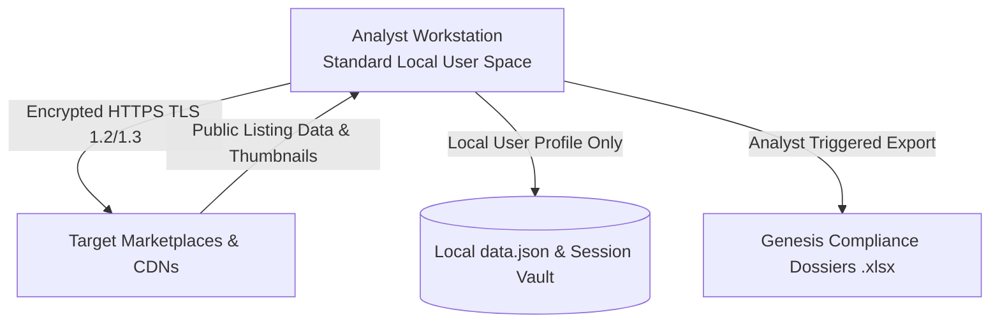

# Apollo Brand Intelligence — Security & Architecture Audit
**Application Name:** Apollo Brand Intelligence (Anti-Counterfeit & Brand Protection Harvester)  
**Lead Author & Creator:** Jerry Seidenstucker  
**Copyright:** © 2026 Jerry Seidenstucker. All Rights Reserved.  
**Intended Use:** Brand Protection, Trademark Compliance, Threat Actor Intelligence, and Multi-Marketplace Listing Aggregation  
**Target Workstation Environment:** Enterprise Windows (Corporate / Brand Protection Environments)  
**Runtime Architecture:** Standalone Windows Executable (`--onedir` via PyInstaller, Native Microsoft Edge stealth automation)  

---

## 1. Executive Security & Compliance Summary

| Category | Policy / Status | Enterprise Detail |
| :--- | :--- | :--- |
| **Administrative Privileges** | 🟢 **Zero Required (Standard User)** | Runs strictly in user-space (`Standard User`). Never requires UAC prompts, never writes to `C:\Windows` or `C:\Program Files`. |
| **Registry Access** | 🟢 **Zero Writes** | Does not modify Windows Registry keys, system startup entries, or OS security policies. |
| **Telemetry / Tracking** | 🟢 **Zero External Telemetry** | No external analytics, crash reporters, tracking pixels, or third-party servers are contacted. All traffic is strictly bounded to user-targeted marketplaces. |
| **Network Protocol** | 🟢 **Encrypted HTTPS Only (Port 443)** | All outbound network traffic uses TLS 1.2 / TLS 1.3 over standard HTTPS. No unencrypted HTTP is transmitted. |
| **Inbound Ports / Listeners** | 🟢 **Zero Inbound Ports** | Opens no network listeners, local servers, or P2P connections. |
| **Data Storage & Privacy** | 🟢 **100% Local Storage** | Scraped listings, brand registries, seller caches, and exported `.xlsx` dossiers remain strictly on the local machine. |
| **Browser Execution Model** | 🟢 **Native Edge Driver** | Uses Windows' pre-installed Microsoft Edge (`msedge.exe`) in user-profile space without requiring external browser installs or administrative rights. |

---

## 2. Multi-Marketplace Destination Whitelist

The application strictly communicates with the following public e-commerce endpoints and their official Content Delivery Networks (CDNs) for listing retrieval and image previews:

| Marketplace | Primary Endpoints | Asset / Image CDN Endpoints |
| :--- | :--- | :--- |
| **eBay** | `https://www.ebay.com/*`, `https://api.ebay.com/*` | `https://i.ebayimg.com/*` |
| **AliExpress** | `https://www.aliexpress.com/*`, `https://www.aliexpress.us/*` | `https://ae01.alicdn.com/*`, `https://ae-pic-*.aliexpress-media.com/*`, `https://*.alicdn.com/*` |
| **TikTok Shop** | `https://shop.tiktok.com/*` | `https://*.ttcdn-us.com/*`, `https://*.tiktokcdn.com/*` |
| **Scribd** | `https://www.scribd.com/*` | `https://imgv2-*.scribdassets.com/*`, `https://*.scribd.com/*` |
| **Mercado Libre** | `https://*.mercadolibre.com/*`, `https://*.mercadolivre.com.br/*` | `https://http2.mlstatic.com/*` |
| **Vinted** | `https://www.vinted.co.uk/*`, `https://www.vinted.fr/*`, `https://www.vinted.com/*` | `https://images1.vinted.net/*` |
| **ManoMano** | `https://www.manomano.co.uk/*`, `https://www.manomano.fr/*` | `https://*.manomano.com/*` |
| **Temu** | `https://www.temu.com/*` | `https://img.kwcdn.com/*` |
| **Wish** | `https://www.wish.com/*` | `https://canary.contestimg.wish.com/*` |
| **Redbubble** | `https://www.redbubble.com/*` | `https://ih1.redbubble.net/*` |
| **Printerval** | `https://printerval.com/*` | `https://cdn.printerval.com/*` |
| **TeePublic** | `https://www.teepublic.com/*` | `https://res.cloudinary.com/teepublic/*` |
| **Etsy** | `https://www.etsy.com/*` | `https://i.etsystatic.com/*` |
| **Spreadshirt** | `https://www.spreadshirt.com/*`, `https://www.spreadshirt.co.uk/*` | `https://image.spreadshirtmedia.com/*` |
| **Zazzle** | `https://www.zazzle.com/*` | `https://rlv.zcache.com/*` |
| **CafePress** | `https://www.cafepress.com/*` | `https://*.cafepress.com/*` |
| **Threadless** | `https://www.threadless.com/*` | `https://images.threadless.com/*` |
| **TeeSpring (Spring)** | `https://*.creator-spring.com/*` | `https://*.spri.ng/*` |
| **Fine Art America** | `https://fineartamerica.com/*`, `https://pixels.com/*` | `https://images.fineartamerica.com/*` |

---

## 3. Data Flow & Security Architecture



### Key Security & Privacy Controls:
- **Marketplace Session Vault & Authenticated Cookie Isolation:**
  - Authenticated session cookies for high-walled platforms (e.g. Temu, Vinted, TikTok) are persisted strictly in `%LOCALAPPDATA%\Apollo_Brand_Intelligence\sessions\` and `%LOCALAPPDATA%\Apollo_<Platform>_Session\`.
  - Stored inside the active OS user's encrypted personal profile space (`Standard User`), never accessible across network shares, and never transmitted to any third-party or cloud server.
- **Persistent Investigation Results & Seller Intelligence:**
  - All investigation session results, resolved seller registries, corporate origin cross-references, and dealer whitelists are stored locally in `%LOCALAPPDATA%\Apollo_Brand_Intelligence\data.json` and `%LOCALAPPDATA%\Apollo_Brand_Intelligence\aliexpress_store_cache.json`.
- **API Credentials:** If optional eBay Developer API keys (`App ID`, `Cert ID`) are entered, they are stored locally in plaintext/user-space in `data.json` and transmitted strictly to official OAuth endpoints (`https://api.ebay.com/identity/v1/oauth2/token`).
- **Zero Remote Telemetry & Complete Air-Gapped Data Containment:** No telemetry, analytics, error reporting, or background pings are made to any remote servers. All operations run 100% locally.
- **Enterprise EDR Compatibility:** Operating in a fixed folder structure (`--onedir`) prevents heuristic behavioral flags triggered by one-file extraction into temporary folders.

---

## 4. Integrity Verification

To verify the SHA-256 cryptographic checksum of `Apollo Brand Intelligence.exe` on your workstation:
```powershell
Get-FileHash -Algorithm SHA256 .\"Apollo Brand Intelligence.exe"
```

---

## 5. Security Attestation & Compliance Statement

Apollo Brand Intelligence v3.0 is engineered specifically for brand protection and intellectual property enforcement operations. It introduces no background services, no persistent system hooks, and adheres strictly to corporate data containment policies by maintaining all investigation records locally.
