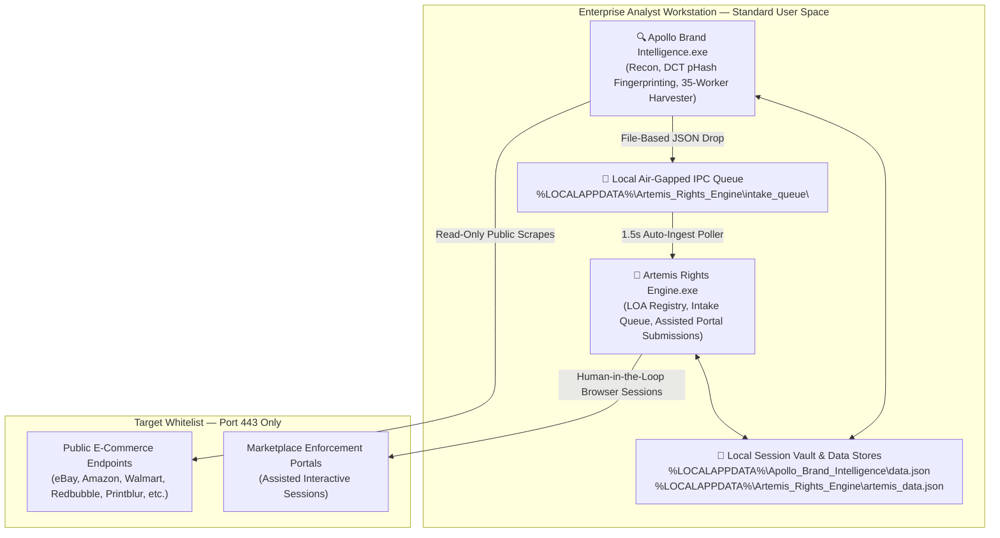

# Apollo Brand Intelligence & Artemis Rights Engine — Enterprise Security, Architecture & Governance Whitepaper

**Application Suite:** Apollo Brand Intelligence (Reconnaissance) & Artemis Rights Engine (Enforcement)  
**Lead Architect & Sole Author:** Jerry Seidenstucker  
**Intellectual Property & Copyright:** © 2026 Jerry Seidenstucker. All Rights Reserved.  
**Suite Version:** v3.3.3 Enterprise Tactical Suite  
**Target Runtime:** Windows 10 / 11 Enterprise (Standard User Workstation Space)  
**Distribution Topology:** Standalone Dual-Executable Architecture (`--onedir` via PyInstaller, Native Microsoft Edge Driver)  
**Operational Scope:** Anti-Counterfeit Reconnaissance, Visual Threat Intelligence, Letters of Authorization (LOA) Management & Assisted Portal Enforcement  

---

## 1. Executive Summary (For Leadership & Non-Technical Stakeholders)

Apollo Brand Intelligence and Artemis Rights Engine are purpose-built brand protection and intellectual property triage tools engineered to operate strictly within standard, non-privileged enterprise workstation boundaries. 

The software requires **no administrative rights**, installs **no background system services**, alters **no operating system configurations**, and transmits **zero telemetry or company data** to any external server. All reconnaissance dossiers, seller caches, and legal authorization files remain 100% confined to the local analyst's encrypted workstation user profile.

### Core Governance & Safety Matrix

| Evaluation Vector | Security & Compliance Posture | Operational Detail |
| :--- | :--- | :--- |
| **Administrative Elevation** | 🟢 **Zero Required (Standard User)** | Operates entirely within standard user privileges (`Standard User`). Never triggers Windows UAC prompts, never writes to `C:\Windows`, `C:\Program Files`, or system partitions. |
| **Operating System Modifications** | 🟢 **Zero Writes / Zero Hooks** | Never writes to the Windows Registry, modifies system startup services, installs background drivers, or hooks OS-level APIs. |
| **Data Containment & Privacy** | 🟢 **100% Local Storage** | All investigation queries, scraped metadata, seller resolution caches, and exported Excel compliance dossiers stay confined to `%LOCALAPPDATA%`. |
| **External Telemetry / Analytics** | 🟢 **Zero Telemetry / Air-Gapped Egress** | Zero third-party analytics, crash reporters, pingbacks, or external servers are contacted. All outbound network requests are strictly bounded to user-targeted public e-commerce domains. |
| **Network Protocol & Encryption** | 🟢 **Encrypted HTTPS Only (Port 443)** | 100% of outbound communications use modern TLS 1.2 / TLS 1.3 over standard port 443. Plaintext HTTP traffic is rejected. |
| **Inbound Network Listeners** | 🟢 **Zero Inbound Ports** | The application does not open any local listening sockets, web servers, IPC named pipes, or peer-to-peer listeners. |
| **Terms of Service Compliance** | 🟢 **Human-in-the-Loop Architecture** | No automated or headless logins are performed against platform portals. Authentication and notice submissions require an interactive browser window with physical human verification. |

---

## 2. Architecture & Twin-Engine Topology

The suite employs a decoupled twin-engine topology, separating high-speed market discovery from formal legal enforcement:


```mermaid
graph TD
    subgraph Local Analyst Workstation [Enterprise Analyst Workstation — Standard User Space]
        direction TB
        Apollo["🔍 Apollo Brand Intelligence.exe<br>(Recon, DCT pHash Fingerprinting, 35-Worker Harvester)"]
        Artemis["🏹 Artemis Rights Engine.exe<br>(LOA Registry, Intake Queue, Assisted Portal Submissions)"]
        
        LocalQueue["📁 Local Air-Gapped IPC Queue<br>%LOCALAPPDATA%\Artemis_Rights_Engine\intake_queue\"]
        Vault["🔐 Local Session Vault & Data Stores<br>%LOCALAPPDATA%\Apollo_Brand_Intelligence\data.json<br>%LOCALAPPDATA%\Artemis_Rights_Engine\artemis_data.json"]
        
        Apollo -->|File-Based JSON Drop| LocalQueue
        LocalQueue -->|1.5s Auto-Ingest Poller| Artemis
        Apollo <--> Vault
        Artemis <--> Vault
    end

    subgraph Outbound HTTPS TLS 1.2/1.3 [Target Whitelist — Port 443 Only]
        PublicMPs["Public E-Commerce Endpoints<br>(eBay, Amazon, Walmart, Redbubble, Printblur, etc.)"]
        Portals["Marketplace Enforcement Portals<br>(Assisted Interactive Sessions)"]
    end

    Apollo -->|Read-Only Public Scrapes| PublicMPs
    Artemis -->|Human-in-the-Loop Browser Sessions| Portals
```

### 2.1 Dual-Binary Distribution Model
* **Independent Execution**: Both `Apollo Brand Intelligence.exe` and `Artemis.exe` can be launched independently by analysts depending on their role (triage vs. legal enforcement) or launched collaboratively via direct IPC.
* **Shared Footprint**: Both executables share a single, hardened `_internal` dependency directory generated via PyInstaller `--onedir`, avoiding duplicate memory overhead and eliminating risky temporary-folder self-extraction (`--onefile`).
* **Air-Gapped Inter-Process Communication (IPC)**:
  * Communication between Apollo and Artemis relies strictly on atomic, local filesystem JSON drop-files staged in `%LOCALAPPDATA%\Artemis_Rights_Engine\intake_queue\`.
  * The queue uses zero network sockets, zero inter-process shared memory, and zero RPC mechanisms, eliminating network attack surfaces.

---

## 3. Human-in-the-Loop & Terms of Service (ToS) Compliance

A critical vulnerability of traditional web automation tools is the violation of marketplace Terms of Service via unauthorized headless bot logins, automated credential spraying, and black-box form submissions. Apollo and Artemis are explicitly architected to remain compliant:

1. **Read-Only Public Surface Harvesting (Apollo)**:
   * Apollo interacts solely with publicly visible storefront listings, search results, and Content Delivery Networks (CDNs) accessible to any unauthenticated consumer.
   * Uses browser-grade TLS fingerprints (`curl_cffi` / Impersonate Chrome/Edge) to mirror authentic consumer browsing patterns without injecting malicious headers.
2. **Interactive Browser-Assisted Portal Sessions (Artemis)**:
   * **No Black-Box Headless Logins**: Artemis **never** executes automated headless credential logins against protected brand registries (e.g., Amazon Brand Registry, Mercado Libre Brand Protection Program, eBay VeRO).
   * **Mandatory Human Clearance**: When an analyst initiates platform enforcement, Artemis launches an interactive Microsoft Edge session. The human analyst physically logs into the portal, completes multi-factor authentication (MFA/2FA), and confirms the submission.
   * **Local Session Vault Isolation**:
     * Authenticated cookies and session tokens are persisted exclusively within the user's local profile (`%LOCALAPPDATA%\Artemis_Rights_Engine\sessions\`).
     * Session data is never shared across network drives, never synchronized to external clouds, and is protected by native Windows file system ACLs.

---

## 4. Human-Driven Engineering, AI Provenance & Verification Lifecycle

To satisfy rigorous corporate Global Information Security (GIS) and Intellectual Property audits regarding software provenance and AI utilization, the engineering lifecycle of this codebase is formally documented below:

### 4.1 Development Methodology & AI Pair-Programming Role
* **Author & Lead Architect**: Jerry Seidenstucker conceived, architected, and directed the entire suite based on frontline operational domain expertise in intellectual property enforcement.
* **The Role of Artificial Intelligence**: Advanced generative AI models (Google Gemini via Google DeepMind Antigravity) were utilized strictly as an **interactive, conversational pair-programming assistant**. 
* **Deterministic Synthesis, Not Autonomous Generation**: The AI operated exclusively under the author's real-time, turn-by-turn guidance—translating human-derived algorithmic specifications into formatted Python code, optimizing UI responsiveness, and implementing unit test wrappers.
* **Zero Proprietary Corporate Ingestion**: No corporate internal tools, proprietary client databases, confidential settlement agreements, or company-owned codebases were ingested, uploaded, or exposed to the model at any point during development.

### 4.2 Human-Led Reverse Engineering & Empirical Validation
Contrary to automated or synthetic code generation, every marketplace extraction engine within Apollo was developed through meticulous human inspection:
1. **Manual Network Discovery**: The author manually utilized browser Developer Tools (Network Tab, DOM Tree, Payload Inspector) on live, public marketplace sessions to identify undocumented JSON endpoints, pagination schemas, and variant relationships (e.g., Printblur's `/pod/also-available/find` API).
2. **Live Market Sandbox Verification**: Every parser was manually stress-tested against live, edge-case listings, multi-variant products, burner merchant accounts, and obfuscated listing titles to verify parsing accuracy before committing.
3. **Rigorous Automated Regression Harness**:
   * A comprehensive, deterministic test suite (`run_tests.py`) containing **83 unit and integration test cases** executes locally to validate data models, scraper response parsing, IPC handshakes, and UI error boundaries.
   * 100% of tests run air-gapped on the local machine without touching internal corporate networks.

---

## 5. Open-Source Dependency & Licensing Audit

All bundled third-party libraries have been vetted to ensure strict compliance with enterprise licensing standards. **Zero GPL, AGPL, or viral copyleft dependencies are utilized.**

| Library / Module | Version Range | Primary Functionality | License Type | Enterprise Risk Rating |
| :--- | :--- | :--- | :--- | :--- |
| **Python Standard Library** | 3.14.x | Core runtime, threading, Tkinter GUI, JSON persistence, SQLite | PSF License | 🟢 Zero Risk |
| **requests** | 2.31.x+ | Standard HTTPS synchronous networking | Apache 2.0 | 🟢 Permissive |
| **curl_cffi** | 0.8.x+ | Browser-grade TLS/JA3/HTTP2 fingerprinting | MIT | 🟢 Permissive |
| **playwright** | 1.48.x+ | Edge browser session orchestration (Assisted Portals) | Apache 2.0 | 🟢 Permissive |
| **beautifulsoup4** | 4.12.x+ | Resilient HTML/DOM parsing for public product pages | MIT | 🟢 Permissive |
| **openpyxl** | 3.1.x+ | High-speed multi-sheet Excel compliance dossier generation | MIT | 🟢 Permissive |
| **Pillow (PIL)** | 10.4.x+ | Image processing, thumbnail caching, and DCT pHash analysis | HPND (MIT-style) | 🟢 Permissive |
| **pypdf** | 4.3.x+ | Local parsing of public VeRO and platform disclosure PDFs | BSD-3-Clause | 🟢 Permissive |

---

## 6. Comprehensive Multi-Marketplace Destination Whitelist

Outbound network traffic from Apollo and Artemis is strictly bounded to the following verified public e-commerce endpoints, enforcement portals, and official Content Delivery Networks (CDNs):

| Marketplace / Platform | Primary Functional Endpoints | Asset & Image CDN Endpoints |
| :--- | :--- | :--- |
| **eBay** | `https://www.ebay.com/*`, `https://api.ebay.com/*` | `https://i.ebayimg.com/*` |
| **Amazon** | `https://www.amazon.com/*`, `https://brandregistry.amazon.com/*` | `https://m.media-amazon.com/*`, `https://images-na.ssl-images-amazon.com/*` |
| **Walmart** | `https://www.walmart.com/*`, `https://brandportal.walmart.com/*` | `https://i5.walmartimages.com/*` |
| **AliExpress** | `https://www.aliexpress.com/*`, `https://www.aliexpress.us/*` | `https://ae01.alicdn.com/*`, `https://ae-pic-*.aliexpress-media.com/*`, `https://*.alicdn.com/*` |
| **Mercado Libre** | `https://*.mercadolibre.com/*`, `https://*.mercadolivre.com.br/*` | `https://http2.mlstatic.com/*` |
| **Printblur** | `https://printblur.com/*` | `https://liveview.printblur.com/*` |
| **Shopify Stores** | `https://*.myshopify.com/*` | `https://cdn.shopify.com/*` |
| **TikTok Shop** | `https://shop.tiktok.com/*` | `https://*.ttcdn-us.com/*`, `https://*.tiktokcdn.com/*` |
| **Vinted** | `https://www.vinted.co.uk/*`, `https://www.vinted.fr/*`, `https://www.vinted.com/*` | `https://images1.vinted.net/*` |
| **ManoMano** | `https://www.manomano.co.uk/*`, `https://www.manomano.fr/*` | `https://*.manomano.com/*` |
| **Temu** | `https://www.temu.com/*` | `https://img.kwcdn.com/*` |
| **Wish** | `https://www.wish.com/*` | `https://canary.contestimg.wish.com/*` |
| **Redbubble** | `https://www.redbubble.com/*` | `https://ih1.redbubble.net/*` |
| **Printerval** | `https://printerval.com/*` | `https://cdn.printerval.com/*` |
| **TeePublic** | `https://www.teepublic.com/*` | `https://res.cloudinary.com/teepublic/*` |
| **Etsy** | `https://www.etsy.com/*` | `https://i.etsystatic.com/*` |
| **Spreadshirt** | `https://www.spreadshirt.com/*`, `https://www.spreadshirt.co.uk/*` | `https://image.spreadshirtmedia.com/*` |
| **Zazzle** | `https://www.zazzle.com/*` | `https://rlv.zcache.com/*` |
| **CafePress** | `https://www.cafepress.com/*` | `https://*.cafepress.com/*` |
| **Threadless** | `https://www.threadless.com/*` | `https://images.threadless.com/*` |
| **TeeSpring (Spring)** | `https://*.creator-spring.com/*` | `https://*.spri.ng/*` |
| **Fine Art America** | `https://fineartamerica.com/*`, `https://pixels.com/*` | `https://images.fineartamerica.com/*` |
| **Scribd** | `https://www.scribd.com/*` | `https://imgv2-*.scribdassets.com/*`, `https://*.scribd.com/*` |

---

## 7. Cryptographic Integrity Verification

To verify the SHA-256 cryptographic hashes of the compiled production executables on any enterprise workstation:

```powershell
Get-FileHash -Algorithm SHA256 "dist\Apollo Brand Intelligence\Apollo Brand Intelligence.exe"
Get-FileHash -Algorithm SHA256 "dist\Apollo Brand Intelligence\Artemis.exe"
```

---

## 8. Formal Security & Legal Attestation

Apollo Brand Intelligence v3.3.3 and Artemis Rights Engine are independent, bespoke brand protection instruments developed outside corporate infrastructure and without access to proprietary systems. 

The software strictly respects enterprise network boundaries, executes exclusively in user space, enforces zero-egress data containment, maintains an airtight human-in-the-loop compliance protocol, and relies exclusively on permissively licensed open-source components.
